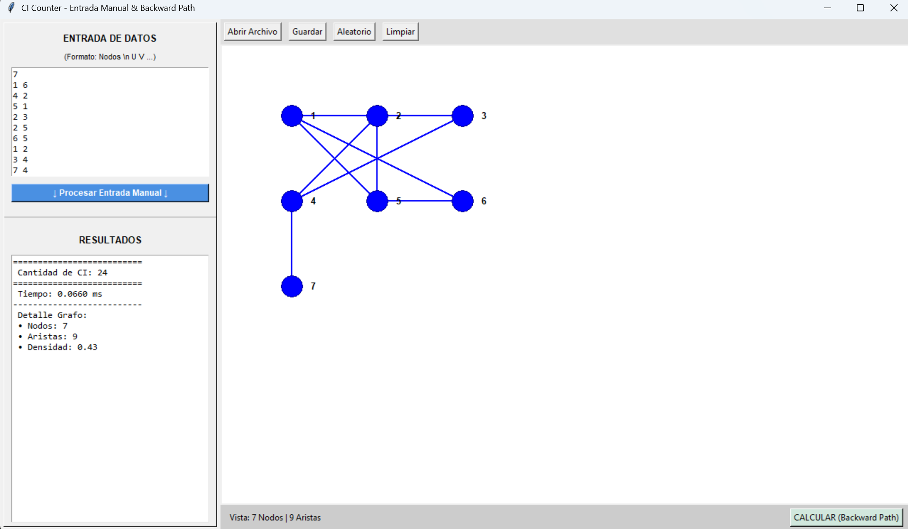
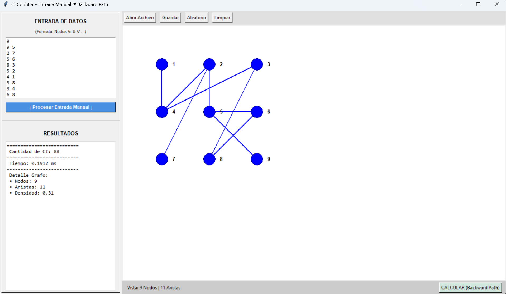
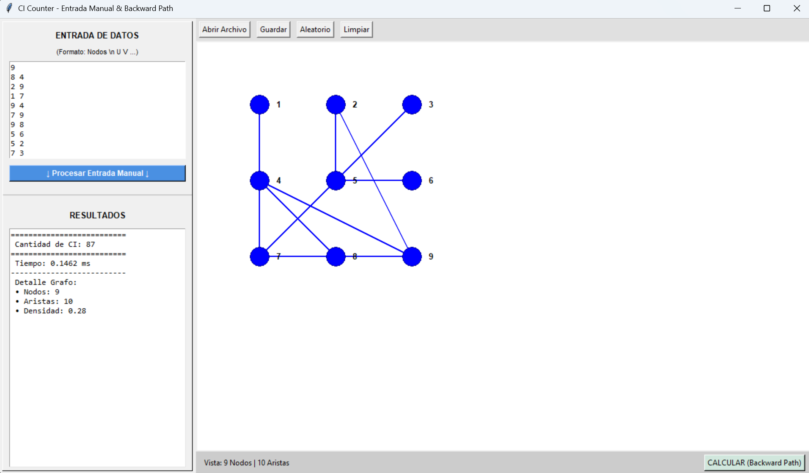

# Contador de Conjuntos Independientes en Grafos

Este proyecto implementa un algoritmo optimizado para contar conjuntos independientes en grafos, utilizando un enfoque de Backward Path con programación dinámica. Incluye una interfaz gráfica interactiva para visualización y pruebas.

## Descripción

El algoritmo calcula el número de conjuntos independientes (conjuntos de vértices sin aristas entre ellos) en estructuras de grafos, optimizado especialmente para mallas y grafos tipo grafeno. Reduce la complejidad computacional mediante técnicas de ventana deslizante y detección automática de casos especiales como ciclos simples, caminos y grafos desconectados.

## Características

- **Algoritmo Optimizado**: Utiliza Backward Path DP para reducir la complejidad de $O(2^t \cdot |E|)$ a $O(2^w \cdot n)$.
- **Interfaz Gráfica**: Aplicación Tkinter con visualización interactiva, entrada manual y cálculo automático.
- **Detección Automática**: Identifica grafos especiales (ciclos, caminos, desconectados) para optimizaciones adicionales.
- **Pruebas de Rendimiento**: Incluye pruebas de estrés para evaluar escalabilidad.
- **Validación**: Comparación entre métodos recursivos y optimizados.

## Requisitos

- Solamente tener descargado el ejecutable

## Instalación

1.- Descarga el ejececutable [Ejecutable](main.exe)
2.- Doble clic sobre el ejecutable
3.- Listo puede empezar a utilizar el proyecto.

## Uso

### Interfaz Gráfica
- **Panel Izquierdo**: Entrada manual de datos (formato: N en primera línea, aristas como U V).
- **Panel Derecho**: Visualización del grafo con nodos arrastrables y herramientas para abrir/guardar archivos.
- El cálculo se realiza automáticamente al ingresar datos válidos.

### Ejemplo de Entrada
```
4
0 1
1 2
2 3
```
Esto representa un grafo con 4 nodos y 3 aristas en línea.

## Capturas de Pantalla








Esto genera grafos de malla cuadrada y mide el tiempo de ejecución.

## Estructura del Proyecto

- `main.py`: Aplicación principal con interfaz gráfica.
- `logic.py`: Motor del algoritmo y clase GraphEngine.
- `algoritmo-backward-path28P.py`: Versión standalone del algoritmo.
- `stress_test.py`: Pruebas de rendimiento.
- `Imagenes/`: Capturas de pantalla y visualizaciones.

## Contribución

Las contribuciones son bienvenidas. Por favor, abre un issue o envía un pull request.

## Licencia

Este proyecto está bajo la Licencia MIT.

## Autor

Dr. Marlene Mijangos Romero.
